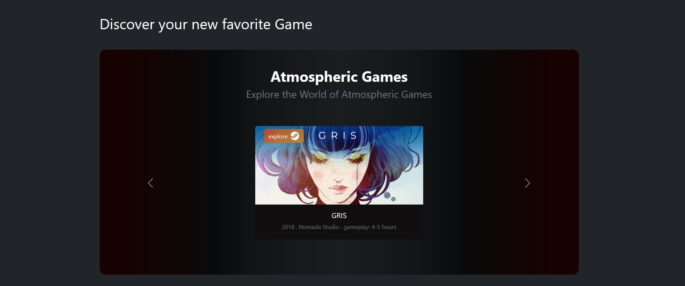
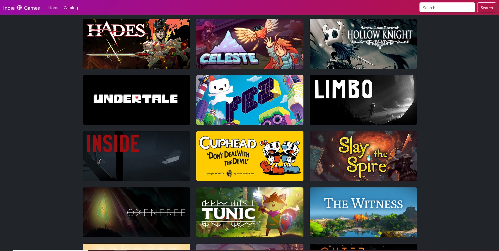
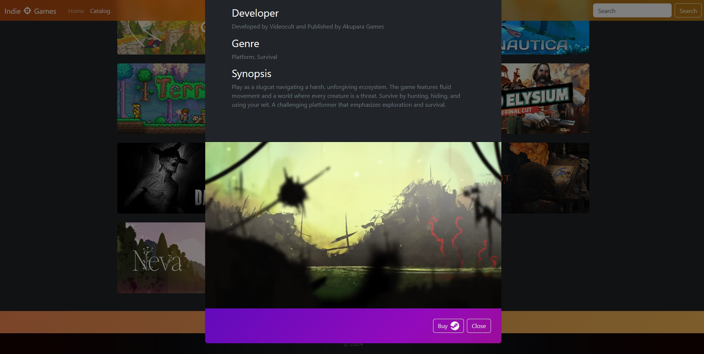

# Indie Games - The Indie Game Discovery Hub

## Description

This project is an interactive platform dedicated to showcasing the creative diversity of indie video games. The site provides a curated space where users can discover, explore, and learn about unique indie games across various genres and styles.

Users can browse a catalog of hand-picked titles, each with detailed information such as game synopsis, developer, release year, and genre. A filtering feature also allows users to search titles by developer, publisher, or genre, ensuring that they can quickly find games that align with their tastes.

The platform aims to celebrate and amplify the work of indie game creators, showcasing the unique experiences and creative visuals that indie games contribute to the gaming world.

## Screenshots






## Key Features

### Home Page

- **Recent Releases**: Display of the latest game launches.
- **Featured Games**: Discover themed game collections presented in a Bootstrap carousel grouped by genre or style.

### Game Catalog

- **Comprehensive Collection**: The catalog page offers a sleek, grid-based layout.
- **Gameplay Preview**: each game is showcased with an interactive hover effect offering a glimpse of the game's mechanics, art style, and overall vibe.
- **Detailed Game Pages**: Click on any game to access an in-depth page featuring:
  - **Game Info**: Title, Developer, Publisher, Genre, Release Year and Revenue information.
  - **Game Synopsis**: A brief description that captures the essence of the game.
  - **Direct Steam Access**: Each game page includes a convenient button that takes you directly to the game's Steam page.

### Filter Feature

- **Search Options**: Quickly locate specific games with a robust filter feature. From any page, users can search by:
  - **Developer**: Discover all games made by a particular developer.
  - **Publisher**: Filter games based on publishing studios.
  - **Name**: Directly locate any game by its title for immediate access.

## JSON Data Structure

The application’s data is loaded from a structured JSON file, where each game’s information is contained within a list of objects under the key `"games"`.

```json
{
  "games": [
    {
      "id": null,
      "poster": "",
      "title": "",
      "developer": "",
      "publisher": "",
      "year": "",
      "length": "",
      "rating": "",
      "revenue": "",
      "aesthetic": [],
      "genre": [],
      "preview": "",
      "steam_page": "",
      "synopsis": ""
    }
  ]
}
```

## Tech Stack

- **HTML5**
- **JavaScript**: Generates dynamic main content and handles hover effects, click events, and filter functionality.
- **Bootstrap Library**: Component design and responsiveness through built-in features like cards, modals, navigation bars, and carousels.
- **CSS3**: Adds custom animations, transitions, and gradients to refine and personalize the Bootstrap design.

## Next Steps

- **Expanding the Game Catalog**: Regularly add new titles to grow the catalog, providing users with a wider variety of indie games and access to the latest releases.
- **Upgraded Carousel Design**: Enhance the carousel to display previews of adjacent cards, creating a smoother, more intuitive browsing experience.
- **User Accounts and Game Tracking**: Add a login feature that lets users create accounts, track games they’ve played, rate games, and build wish lists for titles they want to play.
- **Boosted Interactivity and Personalization**: Introduce features like tailored recommendations based on each user's favorite genres, developers, and game styles for a more personalized experience.

